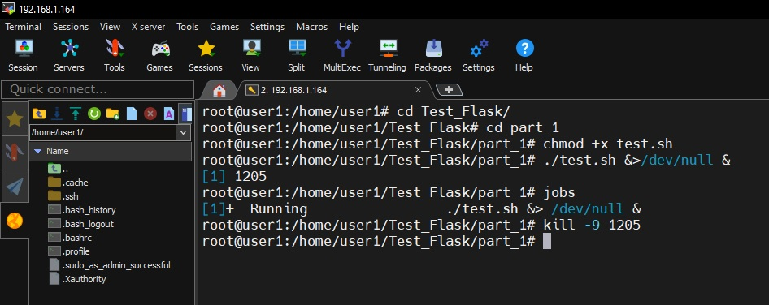
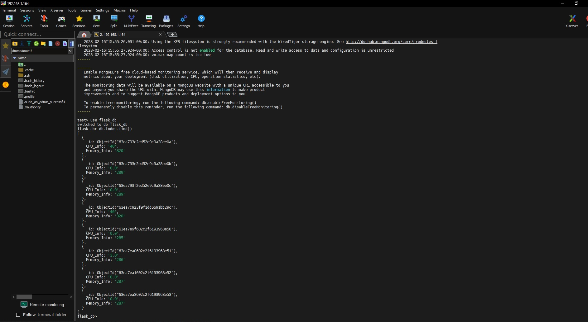
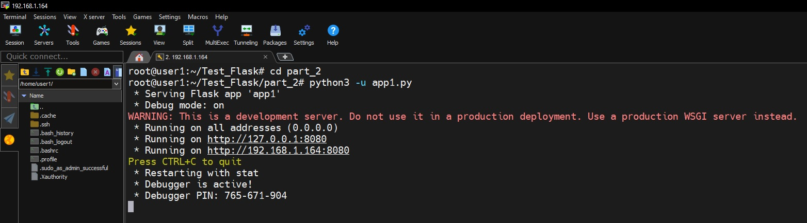
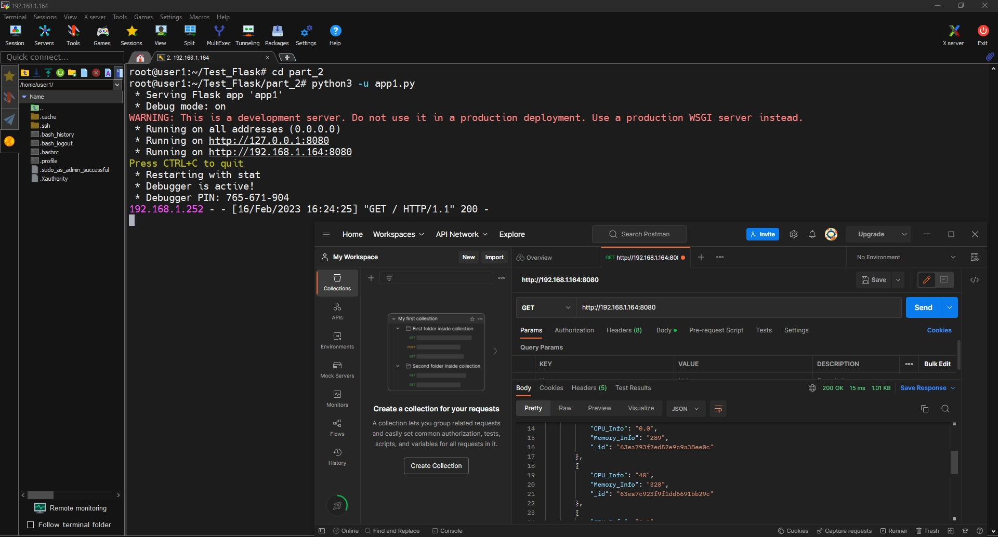
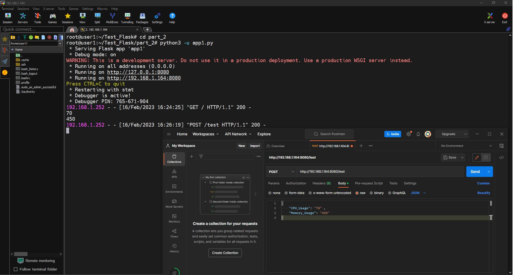
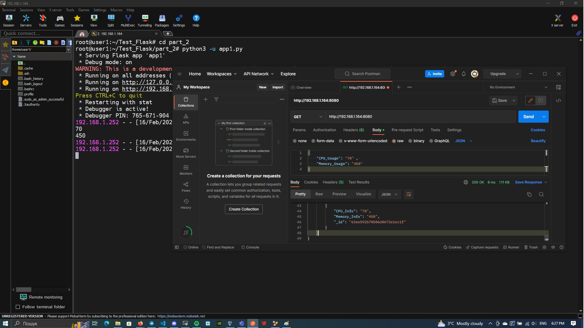
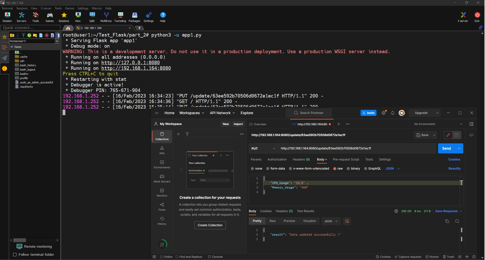
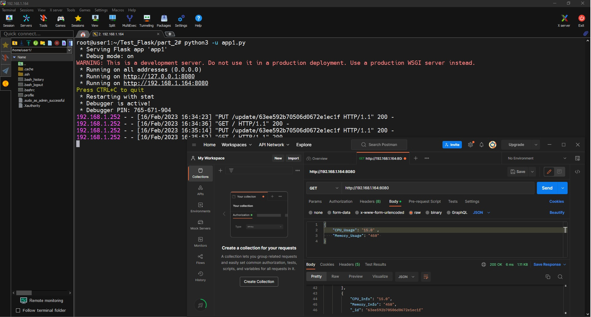

# Test_Task 
Hello everyone! It is my first try to create application that will collect system info(RAM usage, CPU usage) and save it in database(in my case - MongoDB)
So who want to use my application, I wrote this small instruction. Let's start our journay.
## Instruments
<p align="center">
  <a href="https://skillicons.dev">
    
  </a>
</p>

## Installation
#### Clone code from repository
We will used UNIX-based system(Ubuntu 22.04), so if you have git on your machine, you'll write this commands. 
If you don't have GIT,you should install git [Install Git](https://github.com/git-guides/install-git)
```
cat /etc/os-release
pwd 
mkdir My_APP
cd My_APP
git clone https://github.com/Alkaponees/Test_Flask.git
```
### Install Python, pip packet manager and flask
Now we will install python on our machine
```
sudo apt update
sudo apt install python3 -y
python3 --version
```
Okay, we installed Python. Then we can install pip and flask for working with app
```
sudo apt update
sudo apt install python3-pip
sudo apt install python3-flask
```
#### Install MongoDb
It's harder part our work. Therefore you should know how to use NoSQL databases. Let's install MongoDB.
I installed MongoDB 6.0 for local machine
* Perform System Update
```
sudo apt update
sudo apt install wget curl gnupg2 software-properties-common apt-transport-https ca-certificates lsb-release -y
```
*  Import the public key
```
curl -fsSL https://www.mongodb.org/static/pgp/server-6.0.asc|sudo gpg --dearmor -o /etc/apt/trusted.gpg.d/mongodb-6.gpg
```
* Configure MongoDB Repo
```
echo "deb [ arch=amd64,arm64 ] https://repo.mongodb.org/apt/ubuntu $(lsb_release -cs)/mongodb-org/6.0 multiverse" | sudo tee /etc/apt/sources.list.d/mongodb-org-6.0.list
```
* Install MongoDB 6.0 on Ubuntu 22.04
```
wget http://archive.ubuntu.com/ubuntu/pool/main/o/openssl/libssl1.1_1.1.1f-1ubuntu2.16_amd64.deb
sudo dpkg -i ./libssl1.1_1.1.1f-1ubuntu2.16_amd64.deb
sudo apt update
sudo apt install mongodb-org -y
```
After successful installation, start and enable MongoDB:
```
sudo systemctl enable --now mongod
```
* Using MongoDB 6.0 Database
```
mongosh
```
Detail info about install MongoDB on Ubuntu, you can read here --> [Install MongoDB](https://techviewleo.com/install-mongodb-on-ubuntu-linux/)

#### Install Docker Engine
If you want to use this app in container decision, so you need to install Docker Engine.
- Update your existing list of packages
```
sudo apt update 
```
- Next, install a few prerequisite packages which let apt use packages over HTTPS:
```
sudo apt install apt-transport-https ca-certificates curl software-properties-common
```
- Then add the GPG key for the official Docker repository to your system:
```
curl -fsSL https://download.docker.com/linux/ubuntu/gpg | sudo gpg --dearmor -o /usr/share/keyrings/docker-archive-keyring.gpg
```
- Add the Docker repository to APT sources:
```
echo "deb [arch=$(dpkg --print-architecture) signed-by=/usr/share/keyrings/docker-archive-keyring.gpg] https://download.docker.com/linux/ubuntu $(lsb_release -cs) stable" | sudo tee /etc/apt/sources.list.d/docker.list > /dev/null
```
- Update your existing list of packages
```
sudo apt update 
```
- Make sure you are about to install from the Docker repo instead of the default Ubuntu repo:
```
apt-cache policy docker-ce
```
- Finally, install Docker:
```
sudo apt install docker-ce
```
- Enable our Docker:
```
sudo systemctl status docker
sudo systemctl enable docker
```
- Give permision for our home user
In my case, this is user1
``` 
sudo usermod -aG docker user1
```
Congratulation, we installed all dependences for running our app.

## Running
#### Collect system info in database
we have a file test.shin part_1 directory,for collecting system info in database. However we want to use this file, we dhould make it executable.
```
cd Test_Flask/part_1
chmod +x test.sh
```
Okay, we made it executabe
We can run our process in foreground,
~~~
.\test.sh
~~~
or background. 
~~~
 ./test.sh &>/dev/null &
~~~
If you want to delete background, watch on this image


Show info in database, use this command
Enter in database
~~~
mongosh
~~~
Show records in database
~~~
use flask_db
db.todos.find
~~~

#### Run flask app on local machine
Now we run our app on local machine. If you want to do this you should run this command
~~~
cd ~/Test_Flask/part_2
python3 -u app1.py
~~~
Congratulation, you run your app on local machine

#### Testing  on local machine
For testing GET,POST adn PUT request I used Postman. You can install POSTMAN app by this link --> [Install Postman](https://www.postman.com/downloads/)
##### GET request

##### POST request

##### Result POST request

##### PUT request

##### Result PUT request


Congratulation !!! We tested our app on local machine